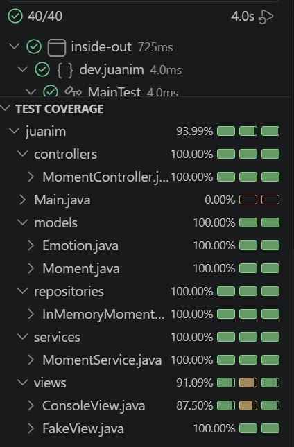
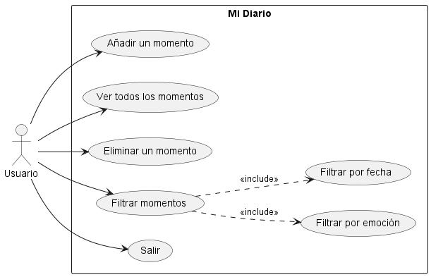
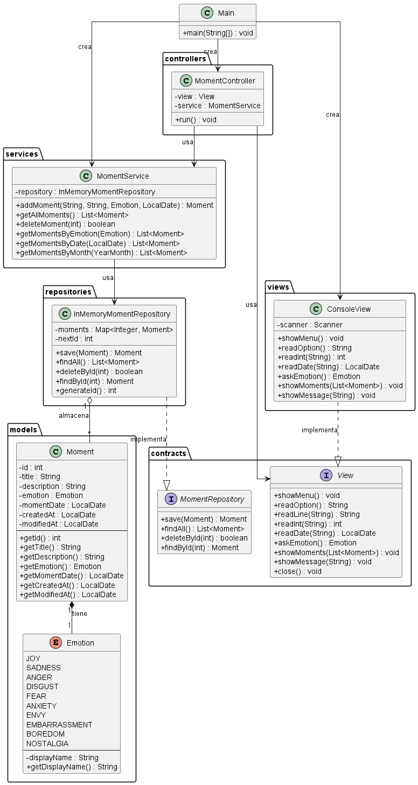
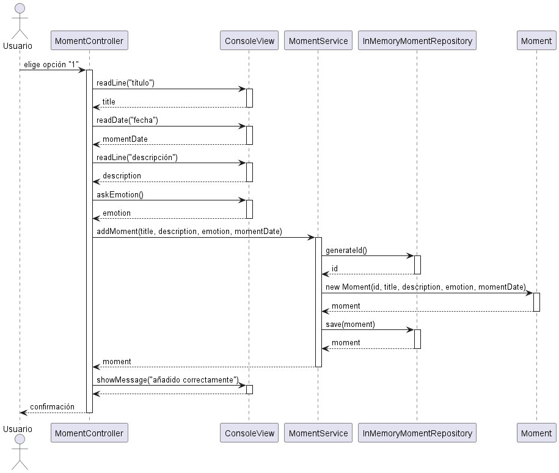

# Mi Diario (Inside Out)

Aplicación de consola en Java para registrar los momentos vividos, cada uno asociado a una emoción y a una fecha. Permite llevar un diario personal donde añadir, consultar, eliminar y filtrar los momentos según cómo se vivieron.

## Descripción

**Mi Diario (Inside Out version)** es una aplicación de línea de comandos que gestiona un diario de momentos vividos. Cada momento guarda un título, una descripción, la emoción con la que se vivió, la fecha en la que ocurrió y las fechas de creación y última modificación del registro.

La aplicación ofrece un menú interactivo desde el que el usuario puede:

- **Añadir** un momento indicando título, fecha, descripción y una de las diez emociones disponibles.
- **Ver** todos los momentos registrados.
- **Eliminar** un momento por su identificador.
- **Filtrar** los momentos por emoción o por fecha.
- **Salir** de la aplicación.

Las diez emociones disponibles son: Alegría, Tristeza, Ira, Asco, Miedo, Ansiedad, Envidia, Vergüenza, Aburrimiento y Nostalgia.

La persistencia es **en memoria**: los momentos se almacenan en un `Map` durante la ejecución del programa.

### Arquitectura

El proyecto sigue una arquitectura por capas con separación de responsabilidades (principio de responsabilidad única, la "S" de SOLID):

| Capa | Paquete | Responsabilidad |
|------|---------|-----------------|
| Modelo | `models` | Entidades del dominio: `Moment` y `Emotion`. |
| Contratos | `contracts` | Interfaces `MomentRepository` y `View`. |
| Persistencia | `repositories` | `InMemoryMomentRepository`, almacenamiento en `Map`. |
| Lógica de negocio | `services` | `MomentService`, reglas de la aplicación. |
| Presentación | `views` | `ConsoleView`, pinta y lee de la consola. |
| Coordinación | `controllers` | `MomentController`, enruta las opciones del menú. |

El controlador depende de la interfaz `View`, no de su implementación concreta, lo que permite inyectar una vista simulada en los tests (inversión de dependencias, la "D" de SOLID).

## Prerrequisitos

- **Java JDK 17** o superior.
- **Apache Maven 3.8** o superior.

Puedes comprobar las versiones instaladas con:

```bash
java -version
mvn -version
```

## Instalación

Clona el repositorio y sitúate en la carpeta del proyecto:

```bash
git clone <url-del-repositorio>
cd inside-out
```

Compila el proyecto y descarga las dependencias:

```bash
mvn clean compile
```

## Ejecución

Para arrancar la aplicación:

```bash
mvn clean compile
java -cp target/classes dev.juanim.Main
```

Al iniciar, se muestra el menú principal. Introduce el número de la opción deseada y pulsa Enter.

## Tests y cobertura

El proyecto incluye pruebas unitarias con **JUnit 5** y mide la cobertura con **JaCoCo**. Para ejecutar los tests:

```bash
mvn clean test
```

Para ejecutar los tests y verificar que se cumplen los umbrales de cobertura (mínimo del 70 %):

```bash
mvn clean verify
```

La cobertura de tests supera el 70 % exigido, cubriendo el modelo, la persistencia, la capa de servicio y la interacción por consola (vista y controlador).

> 

## Diagramas UML

### Diagrama de casos de uso

> 

Refleja las cinco acciones que el usuario puede realizar, con el filtrado desglosado en sus dos variantes (por emoción y por fecha).

### Diagrama de clases

> 

Muestra la estructura estática del proyecto: las entidades del dominio, las interfaces con sus implementaciones y las relaciones entre las capas.

### Diagrama de secuencia

> 

Ilustra el recorrido de la operación "añadir un momento" a través de las capas: del controlador a la vista para pedir los datos, y al servicio y el repositorio para guardarlo.

## Autores

- Juan Isidro Menéndez.